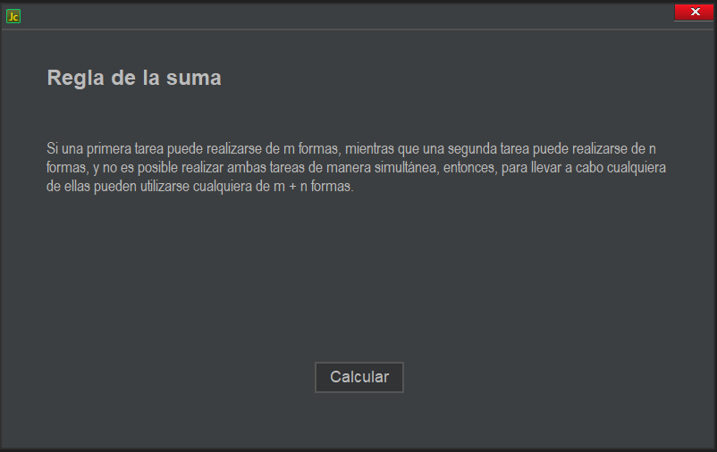

# ✨ Matematicas discretas y combinatoria
🧭 Teoría, teoría aplicada, y algunas soluciones a ejercicios.  

# 📝 Teoría
### 🏹 Principios de la combinatoria
- Regla de la suma.
- Regla del producto.
- Permutación.
